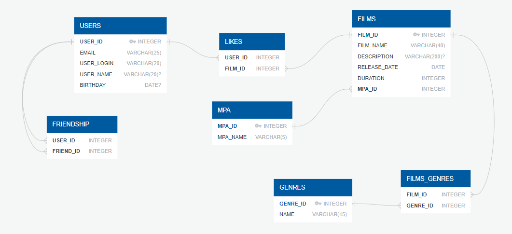

# Filmorate

## Endpoints

### Films
- `[GET] /films` – getting all films
- `[GET] /films/{id}` – getting film by id
- `[GET] /films/popular?count={count}` – getting `count` of the most popular films (request without `count` returns 10 most popular films)
- `[POST] /films` – creating new film
- `[PUT] /films` – updating film
- `[PUT] /films/{id}/like/{userId}` – like film with id = `id` by user with id = `userId`
- `[DELETE] /films/{id}/like/{userId}` – delete like from film with id = `id` by user with id = `userId`

### Users
- `[GET] /users` – getting all users
- `[GET] /users/{id}` – getting user by id
- `[POST] /users` – creating of new user
- `[PUT] /users` – updating of user
- `[PUT] /users/{id}/friends/{friendId}` – add user with id = `friend_id` to friend from user with id = `user_id`
- `[DELETE] /users/{id}/friends/{friendId}` – delete user with id = `friend_id` from user with id = `user_id` friends
- `[GET] /users/{id}/friends` – get all friends of user
- `[GET] /users/{id}/friends/common/{otherId}` – get common friends of two users

### Genres
- `[GET] /genres` – getting all genres
- `[GET] /genres/{id}` – getting genre by id

### MPA (Motion Picture Association film rating system)
- `[GET] /mpa` – getting all MPA ratings
- `[GET] /genres/{id}` – getting MPA by id

## Entity–relationship model
